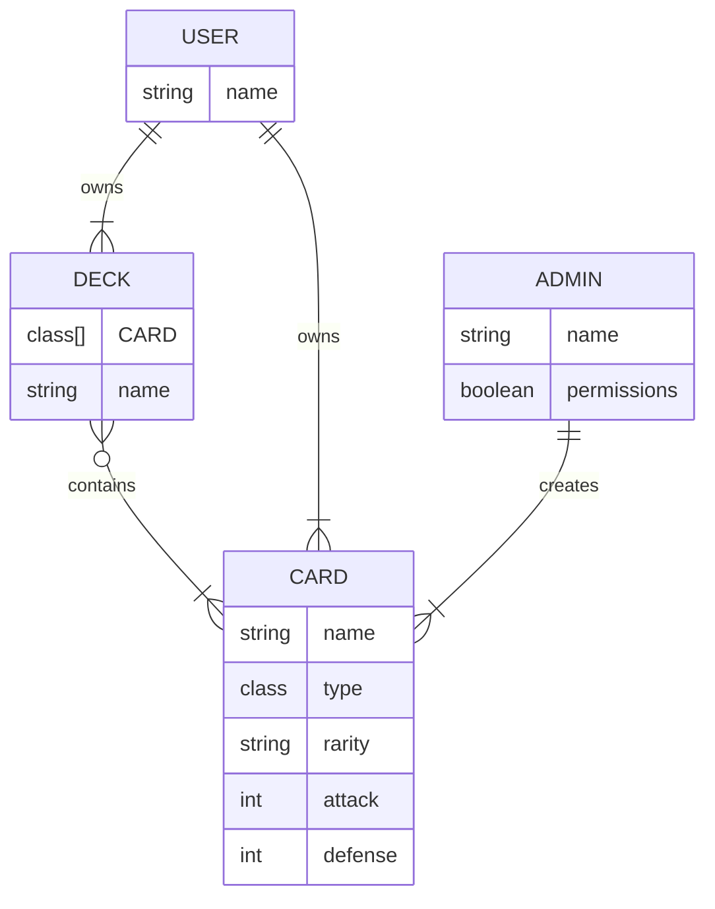
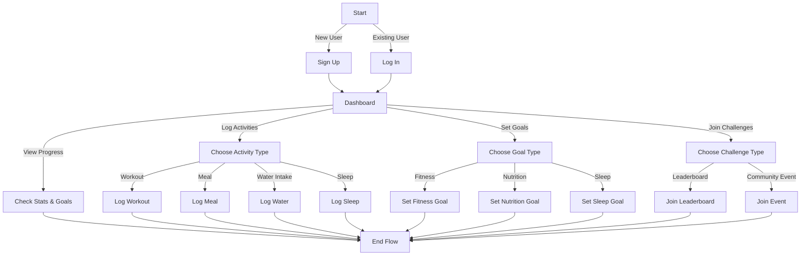

```mermaid
erDiagram

    DECK }o--|{ CARD : contains
    USER ||-- |{ CARD : owns
    USER ||--|{ DECK : owns
    ADMIN ||--|{ CARD : creates
    
    
    CARD {
        string name
        class type
        string rarity
        int attack
        int defense
    }
    DECK {
        class[] CARD
        string name
        
    }
    USER {
        string name
        
    }
    ADMIN {
        string name
        boolean permissions
        
    }
```
```mermaid
flowchart
    A[Start] -->|New User| B|Sign Up|


```

```mermaid
flowchart TD
    A[Start] -->|New User| B[Sign Up]
    A -->|Existing User| C[Log In]
    
    B --> D[Dashboard]
    C --> D

    D -->|Log Activities| E[Choose Activity Type]
    E -->|Workout| F[Log Workout]
    E -->|Meal| G[Log Meal]
    E -->|Water Intake| H[Log Water]
    E -->|Sleep| I[Log Sleep]

    D -->|Set Goals| J[Choose Goal Type]
    J -->|Fitness| K[Set Fitness Goal]
    J -->|Nutrition| L[Set Nutrition Goal]
    J -->|Sleep| M[Set Sleep Goal]

    D -->|Join Challenges| N[Choose Challenge Type]
    N -->|Leaderboard| O[Join Leaderboard]
    N -->|Community Event| P[Join Event]

    D -->|View Progress| Q[Check Stats & Goals]
    
    Q --> R[End Flow]
    F --> R
    G --> R
    H --> R
    I --> R
    K --> R
    L --> R
    M --> R
    O --> R
    P --> R
```

