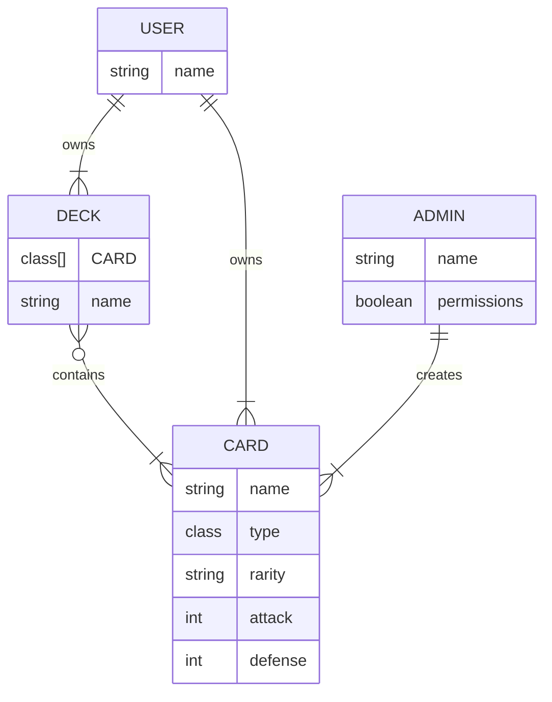
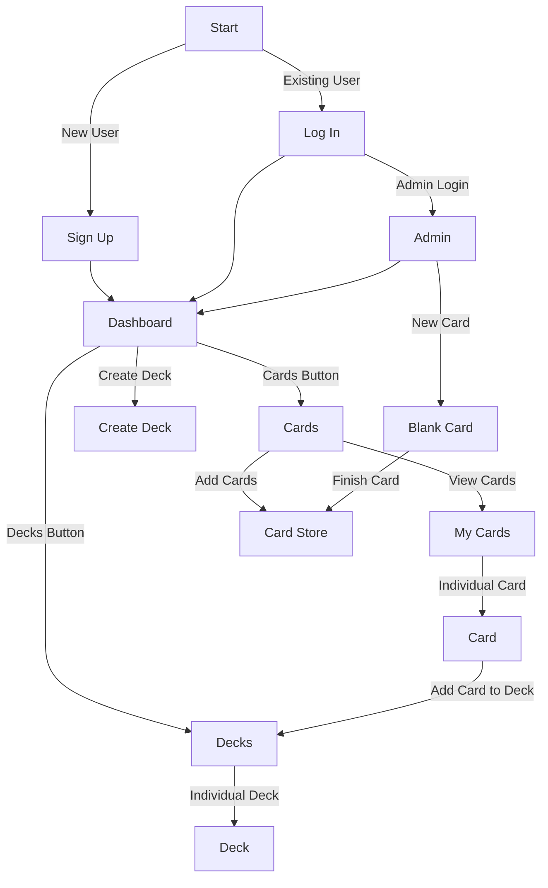
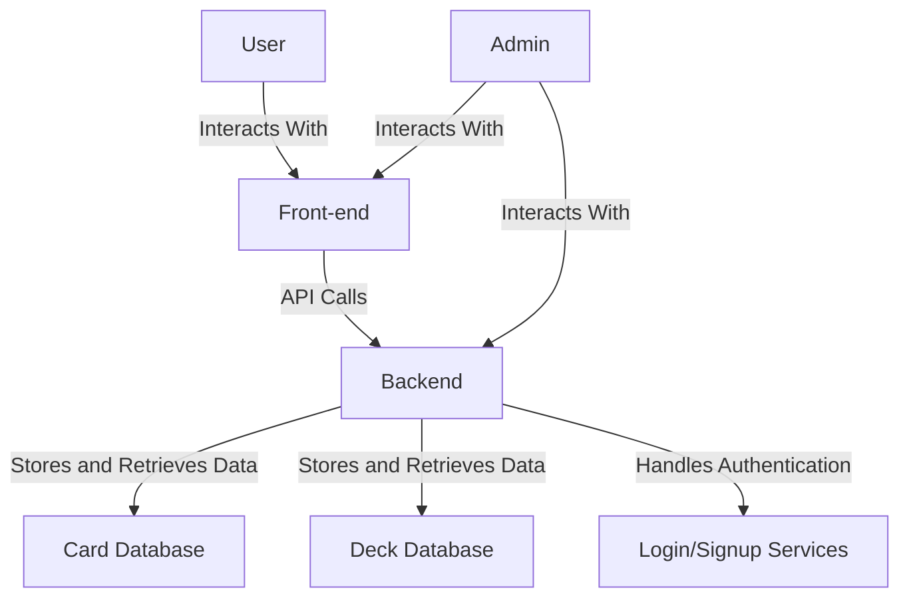

| Endpoint                      | Method | Authentication |
|-------------------------------|--------|----------------|
| `/api/cards`                  | GET    | No             |
| `/api/cards:id`               | GET    | No             |
| `/api/cards`                  | POST   | Yes, Admin     |
| `/api/cards/:id`              | PUT    | Yes, Admin     |
| `/api/cards/:id`              | DELETE | Yes, Admin     |
| `/api/decks`                  | GET    | Yes, User      |
| `/api/decks/:id`              | GET    | Yes, User      |
| `/api/decks`                  | POST   | Yes, User      |
| `/api/decks/:id`              | PUT    | Yes, User      |
| `/api/decks/:id`              | DELETE | Yes, User      |
| `/api/authorization/login`    | POST   | No             |
| `/api/authorization/register` | POST   | No             |
| `/api/authorization/logout`   | POST   | Yes, User      |